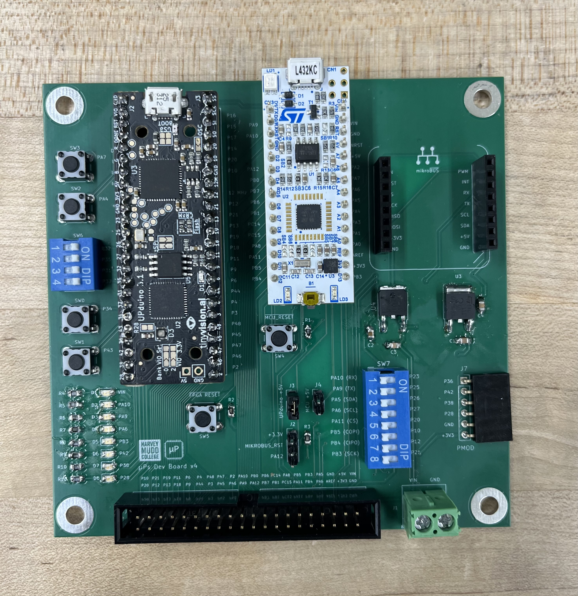
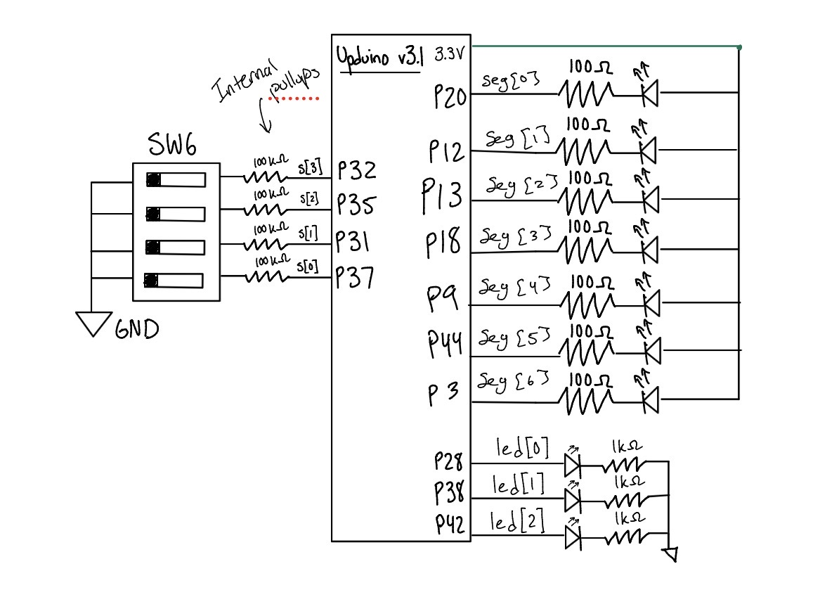
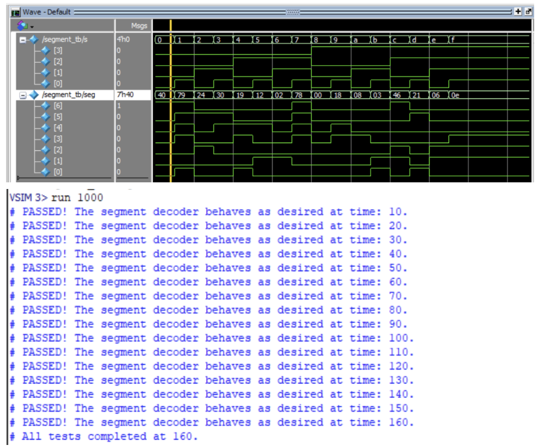
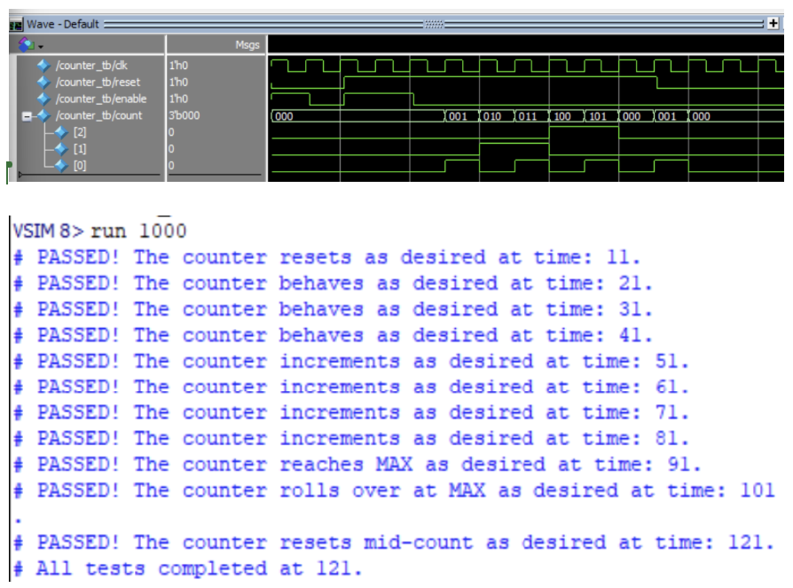
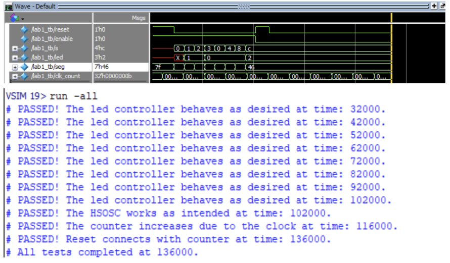

## Introduction
In this lab, a development board that combines an FPGA and microcontroller was assembled by soldering surface mount and through-hole components, and a SystemVerilog design was implemented on the [UPduino v3.1 FPGA](https://tinyvision.ai/products/fpga-development-board-upduino-v3-1?srsltid=AfmBOoqXjkh4n-9gW1HjXNOWm0b4ySK_AJRF_WvL9qQCIZqjqcqFcVpX) to demonstrate the functionality of that board. Code was written to control three on-board LEDS and a 7-Segment Display using 4 DIP switch inputs on the board. 

## Design and Testing Methodology
### Development Board Interface 
To start, the development board system consisted of voltage regulators, buttons, and switches that were hand-soldered onto the board. The two development boards integrated into this PCB were the [UPduino v3.1 FPGA](https://tinyvision.ai/products/fpga-development-board-upduino-v3-1?srsltid=AfmBOoqXjkh4n-9gW1HjXNOWm0b4ySK_AJRF_WvL9qQCIZqjqcqFcVpX) and the [Nucleo-L432KC MCU](https://www.mouser.com/en/ProductDetail/STMicroelectronics/NUCLEO-L432KC?qs=qzCNEk%252BRr%252BajjPvxjwWK5g%3D%3D&utm_id=22340414368&utm_source=google&utm_medium=cpc&utm_marketing_tactic=amercorp&gad_source=1&gad_campaignid=22336774796&gbraid=0AAAAADn_wf3b3tpt4xUWa6YQrI_bHRImc&gclid=Cj0KCQjw79nUBhCgARIsADSHka19zvyxDejf-t5XK-hC_RSrzwub7JaLu_vPdxuKvjm12jsPfirJE8kaAgNWEALw_wcB). The finalized setup is shown below in @fig-dev-board:

{#fig-dev-board}

### FPGA Implementation
| Name | Type | Description                                      |   |   |
|-------------|-------------|--------------------------------------------------|---|---|
| s[3:0]      | input       | Four DIP switches |   |   |
| led[2:0]    | output      | 3 On-Board LEDS           |   |   |
| seg[6:0]    | output      | 7-segment display (Common Anode)  |   |   |

:Digital Inputs and Outputs for Lab 1 {#tbl-letters}

The high-speed oscillator (`HSOSC`) from the iCE40 Technology Library was used to generate a clock signal at 24 MHz. Then, a counter was used to divide the high frequency clock signal down so that the blinking frequency could be easily visualized using one of the on-board LEDs.

The design was developed using a simple clock divider module which drives the external LED.

## Technical Documentation:

::: {.callout-note collapse="true"}
## Source Code
The source code for the project can be found in the associated [Github Repo](https://github.com/jgonzs/Microprocessor-Projects).
:::

### Block Diagram

*Lab 1 Block Diagram // Joaquin Gonzalez-Salgado // September 1 2025*

::: {.callout-note collapse="true"}
## Expand to see Block Diagram
{#fig-block-diagram}
:::

The block diagram in @fig-block-diagram demonstrates the overall architecture of the design. The top-level module `lab1_jg` includes three submodules: a high-speed oscillator block (`HSOSC`), a sequential logic counter which acts as a clock divider, and the combinational logic for the 7-Segment display (`sevenSegment`).

### Schematic

*Lab 1 Wiring Schematic // Joaquin Gonzalez-Salgado // September 1 2025*

::: {.callout-note collapse="true"}
## Expand to see Schematic
{#fig-schematic}
:::

@fig-schematic Shows the wiring approach for this lab. Each on-board LED is connected to an SMT 1 k$\Omega$ resistor via the development board. 

As for the 7-Segment display, 5 to 20 mA of current was advised in the lab manual. Since the common anode is tied to 3.3V, Ohm's law can be used to find an effective resistor for this current. (For this calculation, I chose 13 mA of current). This is shown in @eq-resistor:

$$
V = IR \implies R = \frac{V}{I} = \frac{3.3\,\text{V} - 2.0\,\text{V}}{0.013\,\text{A}} = 100\,\Omega
$$ {#eq-resistor}

The calculation for the LED frequency is done by first dividing the clock using the provided HSOSC primitive, then dividing by 2.4 to get the desired maximum count value:

$$
Count_{Max} = \frac{24MHz}{2.4Hz} = 10,000,000
$$

This requires 24 bits, which is 
$$
2^{24} = 16,777,216
$$

## Results and Discussion

::: {.callout-note}
## Results and Discussion
The Design was a Success!
:::

The design successfully met all objectives. The LED truth table was verified both in Questa and the on-board LEDs. `led[0]` correctly implements XOR of S1 and S0, and `led[1]` correctly illuminates only when both S2 and S3 are high (AND). `led[2]` blinks at approximately 2.4 Hz, verified by observing the counter period in simulation. The enable and reset work as intended. All 16 hexadecimal digits (0–F) were confirmed to display correctly on the 7-segment display, with distinguishable representations for visually similar digits such as b vs 8.

### Testbench Simulation

::: {.callout-note collapse="true"}
## Expand to see Simulation Results
{#fig-testbench-1}

{#fig-testbench-2}

{#fig-testbench-3}
:::

@fig-testbench-1, @fig-testbench-2, and @fig-testbench-3 show screenshots of the QuestaSim simulation. Asserts were used to verify all 8 LED truth table cases, all Seven Segment decoder outputs, check if HSOSC produces a clock signal, and if the counter is receiving the clock, reset, and enable signals.

## Conclusion

::: {.callout-note}
## Hours Spent on Lab
This lab took 10 hours. Soldering on the components to the developoment board required a lot of time, and setting up openFPGALoader took a bit as well.
:::

## AI Prototype Summary
The purpose of the AI Prototype is to experiment with utilizing AI as a coding assistant, and analyze the quality, speed, and precision that an LLM can generate code. The prompt for this week is shown below:

::: {.callout-tip}
## AI Prototype (ChatGPT)
**Prompt:** Write SystemVerilog HDL to leverage the internal high speed oscillator in the Lattice UP5K FPGA and blink an LED at 2 Hz. Take full advantage of SystemVerilog syntax, for example, using logic instead of wire and reg.
:::

::: {.callout-note}
## Generated Code:
module top (
    output logic LED
);

    logic clk_hf;
    logic clk_enable;

    assign clk_enable = 1'b1;

    HSOSC #(
        .CLKHF_DIV("0b00")
    ) hf_oscillator (
        .CLKHFPU (1'b1),
        .CLKHFEN (clk_enable),
        .CLKHF   (clk_hf)
    );

    localparam int unsigned TOGGLE_COUNT = 12_000_000 - 1;

    logic [$clog2(TOGGLE_COUNT + 1)-1:0] counter = '0;

    always_ff @(posedge clk_hf) begin
        if (counter == TOGGLE_COUNT) begin
            counter <= '0;
            LED     <= ~LED;
        end
        else begin
            counter <= counter + 1'b1;
        end
    end

endmodule
:::

### Reflection:
Every week I will try a different AI model, just to get a scope of the variety of LLMs. This week is `ChatGPT-5.6`. `ChatGPT-5.6` was able to create code that was synthesizable in Lattice Radiant, and produced a succesful verilog file that allowed for an LED to pulse at `2.01 Hz` (verified via Oscilloscope), completely on the first try. The only work I had to do was route the resulting led output to the pin on the FPGA. 

As for the quality of the output, `ChatGPT-5.6` did exactly what I told it to do, with no errors from Radiant at all. The LLM generated some syntax that I was unfamiliar with, as I have never used `$clog2` before. It also used a different method than what I had used (stating an unsigned integer for the count) so that was new. 

The next time I utilize an LLM in my workflow, I would most likely ask it to use terms/methods that I am familiar with, or explain what the different parts of the SystemVerilog file do. `ChatGPT-5.6` did not explain the workflow at all, and just gave me the code with not context.
