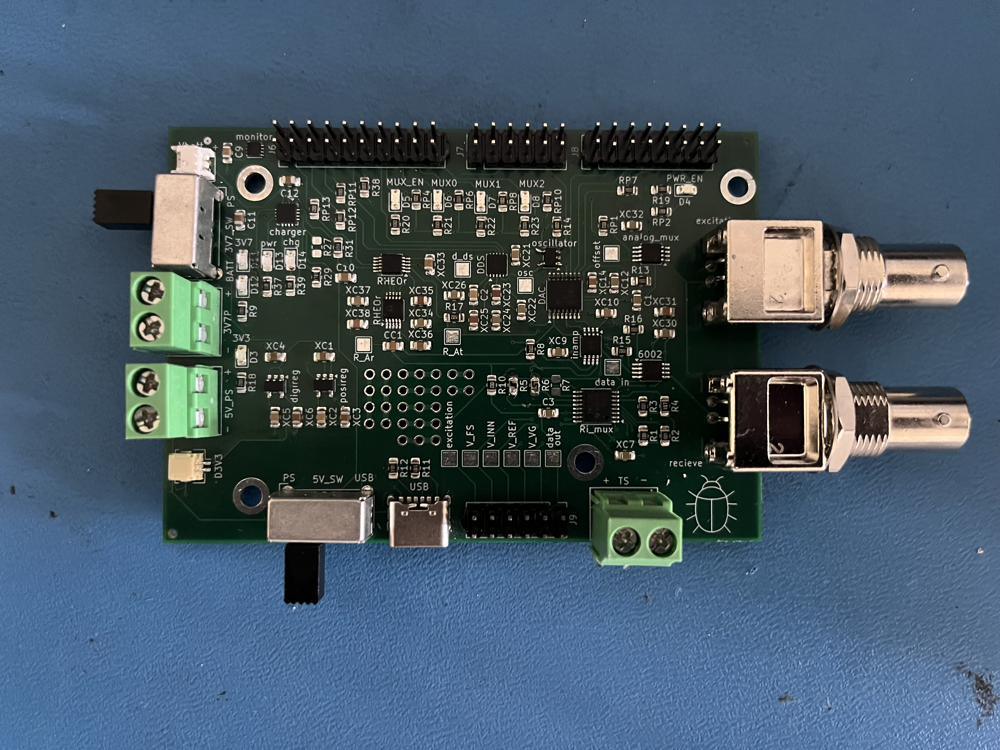
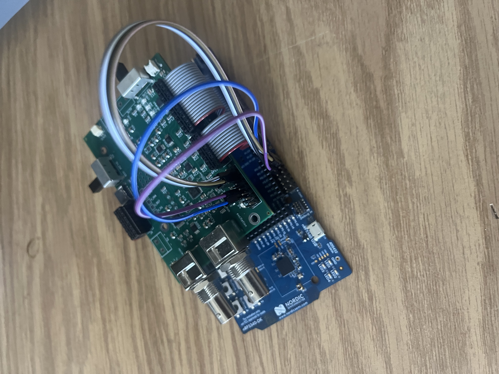

## Electropenetrograph

```{=html}
<div style="display: flex; flex-direction: row; flex-wrap: wrap; gap: 20px; margin-bottom: 1em;">
  <div style="flex: 1; min-width: 200px;">
    
  </div>
  <div style="flex: 1; min-width: 200px;">
    
  </div>
</div>

<p>
  <strong>Overview:</strong><br>
  A mixed-signal <a href="https://en.wikipedia.org/wiki/Electrical_penetration_graph" target="_blank">electropenetrograph</a>
  board designed to interface with the
  <a href="https://www.nordicsemi.com/Products/Development-hardware/nRF5340-DK" target="_blank">Nordic nRF5340 DK</a>.
  The board combines a signal generation chain with a synchronized acquisition chain, using onboard control logic to
  configure gain, switching, and calibration on the fly.
</p>
<p>
  <strong>Key Features:</strong><br>
  Onboard battery charger &amp; monitor ICs, DDS-based signal generation, analog &amp; digital multiplexing,
  DAC output stage, digitally controlled rheostats, I&sup2;C &amp; SPI control interfaces, nRF5340 DK integration.
</p>
```

---

## LiPo Battery Charger & Monitor

```{=html}
<div style="display: flex; flex-direction: row; flex-wrap: wrap; gap: 20px; margin-bottom: 1em;">
  <div style="flex: 1; min-width: 200px;">
    
  </div>
  <div style="flex: 1; min-width: 200px;">
    
  </div>
</div>

<p>
  <strong>Overview:</strong><br>
  (My first PCB!) A single-cell LiPo battery charger and power management board featuring USB-C input, a dedicated charge IC, 5V and 3.7V regulated outputs, fuel gauge IC with I²C interface, and status indicator LEDs. Designed for use as a standalone supply module in embedded systems projects.
</p>
<p>
  <strong>Key Features:</strong><br>
  USB-C charging input, dual regulated outputs (5V / 3.7V), I²C fuel gauge, charge/power-good status LEDs, onboard enable/alert header.
</p>
```

---
