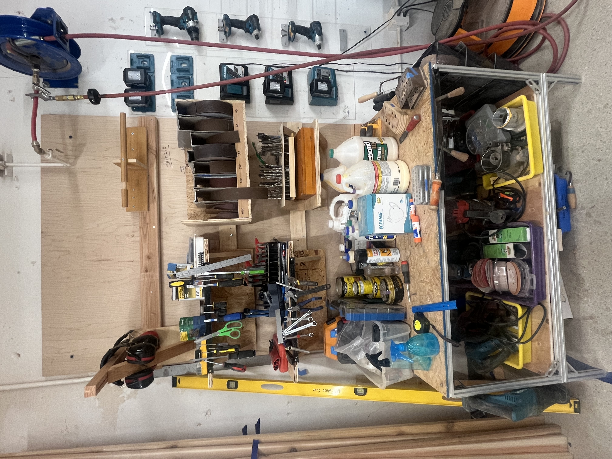
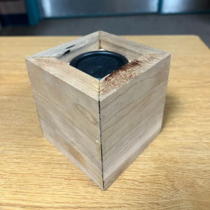
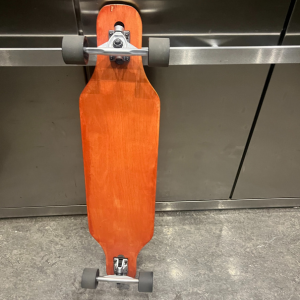

## Wood Shop French Cleat Wall

```{=html}
<div style="display: flex; flex-direction: row; flex-wrap: wrap; gap: 20px; margin-bottom: 1em;">
  <div style="flex: 2; width: 300px;">
    
  </div>
  <div style="flex: 2; min-width: 300px;">
    <p class="justify-text">
      <strong>Overview:</strong><br>
      Designed and built a modular french cleat wall system for the HMC Wood Shop to organize tools and keep the workspace clean and efficient.
      French cleats use interlocking 45° angled cuts to create a flexible, reconfigurable mounting system — any holder or shelf can be moved or swapped without any hardware.
      Cut and assembled custom holders for screwdrivers, wrenches, pliers, drill bits, sandpaper belts, and more.
    </p>
    <p>
      <strong>Skills:</strong><br>
      Table Saw, Woodworking, Shop Organization, Fabrication
    </p>
  </div>
</div>
```
---

## Rockler Wooden Speaker

```{=html}
<div style="display: flex; flex-direction: row; flex-wrap: wrap; gap: 20px; margin-bottom: 1em;">
  <div style="flex: 2; width: 300px;">
    
  </div>
  <div style="flex: 2; min-width: 300px;">
    <p class="justify-text">
      <strong>Overview:</strong><br>
      Created a bluetooth speaker by cutting 8 triangular pieces of plywood, and wood glueing them together in a box orientation!
      Utilized the Rockler's Speaker Set to design and assemble the speaker kit, which connects via AUX and Bluetooth! It's also portable, as it runs on a lithium ion charged battery.
      This project involved a lot of wood shop tools, including a Table Saw, Miter Saw, Planar, and much more!
      This little project has now become a speaker I use day to day!
    </p>
    <p>
      <strong>Skills:</strong><br>
      Table Saw, Miter Saw, Planar, Wood Glue, Soldering, Bluetooth Electronics
    </p>
  </div>
</div>
```

---

## Red-ish Skateboard

```{=html}
<div style="display: flex; flex-direction: row; flex-wrap: wrap; gap: 20px; margin-bottom: 1em;">
  <div style="flex: 2; width: 300px;">
    
  </div>
  <div style="flex: 2; min-width: 300px;">
    <p class="justify-text">
      <strong>Overview:</strong><br>
      Created a skateboard completely from scratch under the HMC Makerspace Grant!
      The materials for this assembly were a sheet of plywood, bearings and tires, grip tape, and red paint, assembled over the course of 3 weeks.
      Used the ShopBot (CNC Router Table) to cut out the skateboard frame. This board is now used to travel around the Harvey Mudd campus!
    </p>
    <p>
      <strong>Skills:</strong><br>
      ShopBot CNC, CAD, Woodworking, Finishing
    </p>
  </div>
</div>
```

